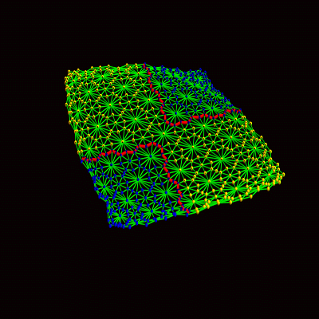

# Εργασία Αλγόριθμοι και Πολυπλοκότητα

## Χρωματισμός γράφου

### Περίληψη εργασίας

Το πρόβλημα του χρωματισμού γραφήματος είναι ένα NP‐hard πρόβλημα συνδυαστικής βελτιστοποίησης. Αφορά την ανάθεση ενός χρώματος σε κάθε κορυφή ενός γραφήματος έτσι ώστε γειτονικές κορυφές να χρωματίζονται με διαφορετικό χρώμα (όπως στο ακόλουθο σχήμα), ενώ παράλληλα χρησιμοποιείται ο ελάχιστος αριθμός διαφορετικών χρωμάτων. Στην παρούσα εργασία ζητείται η υλοποίηση τεσσάρων αλγορίθμων χρωματισμού γραφημάτων και η εφαρμογή τους σε γνωστά προβλήματα από τη βιβλιογραφία.  
## [Τεχνική Αναφορά](./Τεχνική_Αναφορά_ALCO.pdf)

* Χρωματισμός γράφου [wikipedia](https://en.wikipedia.org/wiki/Graph_coloring).
* [Graph Coloring Greedy Algorithm [O(V^2 + E) time complexity]](https://iq.opengenus.org/graph-colouring-greedy-algorithm/)

 
